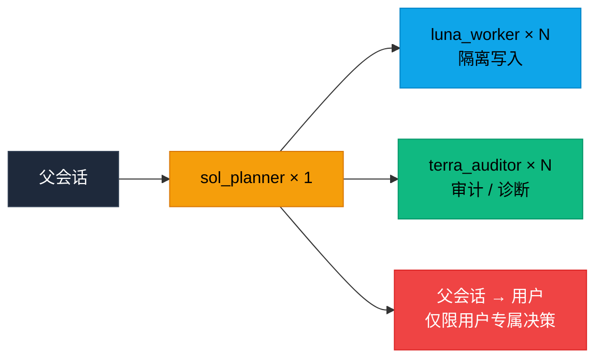
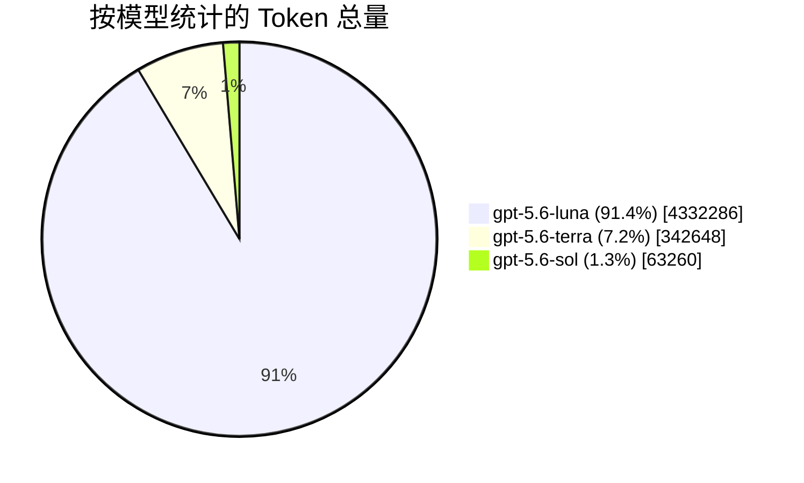

**Lean Dev Router** 是一套用于协调和升级仓库范围内软件工程全生命周期任务的通用理论。它让不同职责和成本层级的 Agent 分别负责**规划、实施、诊断和验证**，并且只在必要时向上升级。

本项目原作者使用Codex，而俺也一样，但是分歧如下
- 原作者希望能够适配到更广泛的Agent，但我更希望它优先适配手中持有的Agent,即Codex
- 为了进一步节省 Token，可以配合 [Caveman](https://github.com/juliusbrussee/caveman) 这类减少工程中冗余表达的项目使用，本项目引入[Skills/Caveman](https://github.com/JuliusBrussee/caveman/blob/main/skills/caveman/SKILL.md)并二改，作为HandOff的核心。但这仅用于Agent交接而不是对用户的呈现，如果需要压缩呈现，你需要另外加载caveman，caveman与交接技能不冲突。

主控对话通常可以使用 **Luna High** 或更低成本的模型，因为它需要完全承受而且sol喜欢偷看subAgent的对话流（何意味）。不需要高质量的模型来需要复杂规划和跨任务协调时，由一个 **Sol** 协调者处理；主控对话保留用户交互入口，并在必要时只做机械中继。


--------下方是原本实现，目前未涉及，仅作为**更新前**的框架路由和核心思想，更新后应该重写，应该承认其代表原本协议，但不约束后续实现→协议将会重写，其措辞存在不合理之处
应承认最终 L3 测试结果，并移入Legacy，后续由用户主动新开Codex实例执行类似任务并比对

### 🧭 工程生命周期任务入口

| 任务类型 | 默认路由 |
|:---|:---|
| 🔧 边界明确的实现、修复、重构、测试、文档或配置 | 直接交给 **Luna**；任务模糊、可拆分、跨模块或决策较多时先使用 **Sol** |
| 🔍 审计、审查、合规检查或发布就绪 | 先使用一个或多个 **Terra**；需要时由 **Sol** 拆分或归并；只有获得授权后才由 **Luna** 修复 |
| 🐛 调查、事件、性能分析或调试 | **Terra** 建立证据和可能原因；**Sol** 裁定范围内的技术取舍，属于用户的选择则交还父会话；**Luna** 实施获得授权的修复 |
| 🔄 迁移、依赖或平台升级 | **Sol** 在已授权范围内规划并确定实施顺序；**Terra** 盘点兼容性与风险；**Luna** 在隔离 worktree 中实施；**Terra** 验证 |
| 👑 重大方向、范围、策略或不可逆承诺 | **Sol** 可以整理选项，但父会话必须将决断权交还用户 |

> ⚠️ 本次扩展**仅覆盖仓库范围内**的软件工程任务。未经用户明确批准，不授予生产部署、破坏性操作、外部承诺或业务及产品策略变更的权限。

### 📡 交接协议

三个角色统一使用以下紧凑、可解析的交接协议：

```text
PROTOCOL: lean-dev-router/v1
AGENT: luna_worker | terra_auditor | sol_planner
STATUS: PASS | BLOCKED | ESCALATE
FAILURE: none | scope | verification | dependency | ambiguity | major-decision
EVIDENCE:
- path: relative/path/to/file
  proof: short diff summary or `command` -> PASS/FAIL
NEXT: parent | luna_worker | terra_auditor | sol_planner | none
SUMMARY: one concise sentence
```

**字段语义：**

- `EVIDENCE` — 必须将仓库结论绑定到具体路径，并附简短 diff 摘要或命令结果
- `PASS` — 当前阶段完成
- `BLOCKED` — 缺少必要信息、权限或依赖
- `ESCALATE` — 需要其他角色继续处理
- `NEXT` — 当前协调者下一步应派发的角色，结果仍返回启动该 Agent 的会话

> 🛡️ 存在 **Sol** 时由 **Sol** 执行，否则由父会话执行。主控**不得**从缺少字段或证据的交接中自行推断成功。

### 🚪 用户决策门

**Sol** 可以裁定不改变既定目标、范围、验收标准和用户授权策略的可逆技术取舍。

涉及**目标、方向、理念、产品优先级、用户明确意图，或不可逆及重大的承诺**时，**Sol** 必须通过父会话将决断权交还用户。

此时 **Sol** 返回：

```text
STATUS: BLOCKED
FAILURE: major-decision
NEXT: parent
```

…并提供最多**三个可行方案**、关键取舍、受影响路径、**一个推荐**和需要询问用户的**唯一问题**。

> 📌 协议不增加 `NEXT: user`：正确路径是 `sol_planner → parent → user`。用户答复后，已有 **Sol** 协调者继续调度其 worker；独立快路径在约束完整确定时直接返回 **Luna**。

### 🔌 Codex 执行方式

默认使用 Codex 原生 subagent。明确且边界清晰的任务直接交给一个 **Luna**；复杂、模糊或可拆分任务默认启动一个 **Sol** 协调者，由其分解、分配、等待和归并多个 **Luna/Terra**。

**核心规则：**

- 相互独立的读取、实现、测试和审查任务均可**并行**
- 每个并行写入的 **Luna** 必须使用独立 worktree 或独立 checkout，并绑定各自分支——只有分支**不构成**隔离
- 只读的 **Terra** **可以**共享 checkout

**在有依赖或写入的交接前**，请确认：
1. 目标 Agent 已加载
2. 模型和思考强度生效
3. 首次结果遵循 `lean-dev-router/v1`

如果 **Sol** 无法嵌套启动 worker，应返回 `BLOCKED/dependency/NEXT parent`，并在 `EVIDENCE` 中提供 `DISPATCH` 清单。每个 worker 条目包含：
`id`、`role`、`scope`、`worktree`（共享只读任务使用 `N/A`）、`depends_on` 和 `acceptance`。

父会话机械执行后，将紧凑结果送回同一个 **Sol**。原生调用完全不可用时，使用相同清单启动独立 Codex session。

> 💡 条件允许时，在依赖原生路由前检查 `codex --version`；在 Codex CLI 中使用 `/agent` 检查 Agent 线程。如果客户端无法启动或无法提供预期的原生流程，应使用 fallback，**不要**静默替换为默认 Agent 或模型。

Codex 原生后台 Agent 界面仍属于原生 subagent 流程；其他后台进程或独立 session 只能作为 fallback，不能视为等价的父子路由。当前 Codex 自定义 Agent 的行为以[官方 Subagents 文档](https://learn.chatgpt.com/docs/agent-configuration/subagents)为准。

### ⚙️ 默认单 Sol Worker 调度

每个路由任务默认只使用**一个 Sol 协调者**。Sol 根据任务规模、数量、独立性、依赖深度和风险决定 Luna/Terra 的数量及组合，负责任务分配、顺序与并发、等待 worker、覆盖检查和结果归并。

> 🚨 **Luna 和 Terra 不得自行创建 Agent 或扩大任务范围。** 只有用户明确要求时才使用多个 Sol；由父会话创建并为每个 Sol 分配**互不重叠**的调度范围，任何 Sol 都**不得**启动同级 Sol。

| 模式 | 请求上限 | 优先目标 |
|:---|:---:|:---|
| `token-first` | 3 | 尽量减少 Agent 总开销 · **默认模式** |
| `balanced` | 6 | 平衡完成时间与 Token 开销 |
| `latency-first` | 10 | 缩短大型独立任务的完成时间 |

上限包含 Luna 与 Terra 的总数，属于调度启发式，不代表客户端或账户一定具备对应并发能力。对相对均匀的项目集合，先使用 `min(模式上限, ceil(项目数 / 30))`，再按复杂度和风险调整。有依赖的阶段保持串行；可用 worker 较少时使用互不重叠的波次。每个 worker 获得精确且不重叠的任务；Sol 确认覆盖完整且交集为空。每个并行 Luna 写入者使用独立 worktree 或独立 checkout，并绑定各自分支；合并顺序由 Sol 决定。

**示例：** 对 282 个已合并 PR 进行 `latency-first` 审计时，使用 **1 个 Sol 协调者** + **10 个 Terra**，每个约 28–29 个 PR。Sol 等待所有批次、检查覆盖范围、归并去重发现，再将高风险或冲突候选交给不同的 Terra 交叉验证。开发任务同样可以让多个 Luna 在隔离 worktree 中并行实现，并搭配 Terra 诊断或独立验证。

> 💡 个人经验：推荐使用 worktree 批量并行处理相互独立的任务，尤其适合同时推进多个 PR。为每个任务分配独立的 worktree 和分支；对于强依赖任务，或必须共享同一工作状态的改动，**不建议**并行处理。



### 📦 内容

| 路径 | 说明 |
|:---|:---|
| `.agents/skills/lean-dev-router/` | 轻量级调度 Skill |
| `agents/` | 示例 Agent 配置：`luna_worker`、`sol_planner`、`terra_auditor` |
| `lean-dev-router-self-test-guide.md` | 用于在自己的代码库中对比 Token 节省、质量和调度开销的受控测试指南 |

### 🚀 安装

对于 **Codex**，复制：
1. `.agents/skills/lean-dev-router/` → `~/.codex/skills/lean-dev-router/`
2. `agents/` 中的三个 TOML 文件 → `~/.codex/agents/`

使用其他运行时或模型时，应相应调整文件格式和模型标识。

### 🎭 角色

| 角色 | 徽章 | 职责 |
|:---|:---:|:---|
| **sol_planner** | 👑 | 复杂任务的唯一规划者和协调者。按需扩缩、指挥并归并 Luna/Terra，属于用户的决策交还父会话。 |
| **luna_worker** | ⚡ | 边界明确的代码、测试、文档和配置改动。多个实例可以在隔离任务上并行运行。 |
| **terra_auditor** | 🔍 | 代码审计、技术诊断和验证。只有无法解决问题或需要重大决策时才升级给 Sol。 |

当任务适合采用这套路由策略时，可以使用 `$lean-dev-router`。该 Skill 不会默认调用全部 Agent，只传递精简的交接信息。

### 📊 最终 L3 测试结果

这是一次 L3 幂等 `POST /orders` 测试记录，测试题来自 [`lean-dev-router-l3-idempotent-orders-task.md`](lean-dev-router-l3-idempotent-orders-task.md)，使用 **Luna High** 主控与 `$lean-dev-router`。下列数据根据用户提供的测试截图整理，**未**在本仓库重新运行。



| 模型 | 总 Token | 占比 | Input | Cached Input | Output | 事件数 |
|:---|---:|:---:|---:|---:|---:|---:|
| `gpt-5.6-luna` | 4,332,286 | 91.4% | 4,304,634 | 4,156,160 | 27,652 | 105 |
| `gpt-5.6-terra` | 342,648 | 7.2% | 335,741 | 301,312 | 6,907 | 11 |
| `gpt-5.6-sol` | 63,260 | 1.3% | 61,736 | 47,360 | 1,524 | 3 |
| **合计** | **4,738,194** | **100%** | **4,702,111** | **4,504,832** | **36,083** | **119** |

| 检查项 | 记录结果 |
|:---|:---|
| ⏱️ 耗时 | **12 分 15 秒** |
| ✅ 必需行为 | 首次创建 `201`；重放 `200`；冲突 key `409`；无效输入 `400` |
| 🔒 并发 | 使用 `RLock` 保护同 key 创建；并发重复提交最终只创建一个订单 |
| 🧪 测试 | `python -m pytest tests/ -q` → **9 passed** ✅ |
| 🎯 范围 | `git diff --stat` 仅涉及 `handlers/orders.py`、`service/order.py`、`service/store.py`、`tests/test_order.py` |
| 📌 基线 | `92ea4575174a163657005711057c97db97776845` |

本次运行中，Luna 之外的模型合计消耗 **405,908** tokens，约占总量 **8.6%**。这表示本次调度运行的成本构成，不等同于独立的节省率；若要得出节省结论，仍需按照测试指南使用相同题包进行 Direct Sol 和 Direct Luna 对照测试。

---

<p align="center">
  <sub>Built with ⚡ by the routing theory · lean-dev-router/v1</sub>
</p>
